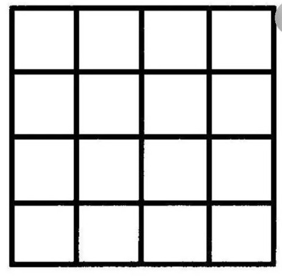

# Ксенокурс по ритму — Материалы для учеников

- - -

## СТАРТОВЫЙ ПАКЕТ

*Скачай и изучи до первого занятия*

- - -

### Подготовка к занятию

Чтобы повысить КПД тренировки, удели время самоподготовке.

**Организуй пространство:**

* Убедись, что тебя не будут беспокоить во время занятия
* Выключи уведомления на телефоне
* Выпей водички :)

- - -

### Разминка перед занятием

*5 минут. Старайся делать перед каждым уроком.*

**1. Встряхни руки** — 10 секунд 

Просто повисшие расслабленные руки, трясёшь от запястья. Это помогает снять зажимы.

**2. Сожми-разожми** — 10 раз каждой рукой. 

Сильно сожми кулак, задержи 2 секунды, резко разожми. Так пальцы становятся немного живее.

**3. Вращение запястий** — по 10 медленных оборотов в каждую сторону.

**4. Суставная гимнастика** — 20 секунд 

Вращение кистей, локтей, плеч, шеи. Все движения выполняй плавно и мягко. Делай глубокий вдох, раскрывая грудную клетку и надувая живот. На выдохе расслабляйся, отпускай напряжение.

**5. Дыхание перед игрой** — займи удобное положение и сделай несколько глубоких вдохов через нос и шумных выдохов, чтобы суета и лишние мысли улетучились.

**6. Сыграй по всем лепесткам свободно** — 1 минута, без задачи, просто слушай инструмент.

- - -

### Как сидеть и держать глюкофон

Удобная посадка помогает развиваться и не уставать

**Сиди так:** стопы на полу, спина прямая, но не напряжённая. Плечи опущены.

**Глюкофон** лежит на коленях горизонтально, лепестки смотрят вверх. Можно положить на нескользящий коврик или небольшую подушку — инструмент не должен ездить.

**Руки:** запястья свободные, удары идут от кисти, а не от локтя. Пальцы чуть округлены, как будто держишь яблоко

**Варианты посадки:**

* **На стуле** — классический вариант, глюкофон на коленях
* **На полу** — например, со скрещенными ногами
* **Стоя** — нужна подставка, зато можно пританцовывать!

- - -

### Рекомендации по метрономам

Метроном нужен с третьего урока, но можно познакомиться с ним и раньше.

**Приложения:** Pro Metronome, Metronome Beats или другие на твой вкус.

**Можно открыть в браузере** — наберите в поиске «метроном».

*Избегай слишком пронзительных кликов — они отвлекают. Ищи деревянный или мягкий колокольный звук. Громкость нужна такая, чтобы слышать чётко, но не заглушать глюкофон.*

- - -

### Таблица темпов

| BPM  | Образ                              |
| ---- | ---------------------------------- |
| 60   | Секундная стрелка / сердце в покое |
| 70   | Неторопливая прогулка              |
| 80   | Быстрая ходьба                     |
| 90   | Лёгкий бег трусцой                 |
| 100+ | Танцевальный темп                  |

*Начинай с 60. Не торопись поднимать темп — лучше медленно и точно, чем быстро и криво. Техника нарабатывается на низких скоростях.*

- - -

### Словарь

**BPM** (beats per minute) — ударов в минуту. Единица измерения темпа.

**Акцент** — выделенный удар. Может быть громче, тише, другим тембром — зависит от тебя.

**Такт** — один полный цикл долей. В 4/4 — это четыре удара.

**Доля** — отдельный удар внутри такта. В размере 4/4 четыре доли: раз-два-три-четыре.

**Темп** — скорость, с которой идёт музыка. Измеряется в BPM.

**Метроном** — устройство или приложение, которое отбивает темп.

**Квадрат** — четыре такта подряд. Базовая единица структуры.

**Пауза** — намеренное молчание в нужном месте.

**Размер** — сколько долей в одном такте. Самый частый — 4/4, то есть четыре доли.

**Сильная доля** — главный удар такта, обычно «раз». Звучит ярче и заметнее.

**Слабая доля** — остальные удары, заполняющие пространство. Также «И» между ударами.

- - -

- - -

## УРОК 1. Ритмическая сетка

Ритм всегда с нами: удары сердца, шаги,  жевание или стиральная машина :) На этом уроке мы сделаем ощущение ритма осознанным.

Познакомимся с **ритмической сеткой**, которая пригодится нам и дальше. Это простая таблица из квадратов, в которую можно вписать любой ритм и увидеть его глазами, а не только услышать.

На уроке будем топать и хлопать.



> 📓 **Совет:** заведи тетрадь в клеточку — в ней удобно рисовать ритмическую сетку, делать пометки по ритмам и быстро находить нужные примеры. А ещё когда мы записываем информацию от руки, она запоминается гораздо лучше.

- - -

### Домашнее задание

Нарисуй в тетради ритмическую сетку

**Задание:** потопай равномерно — левая, правая, левая, правая. И считай вслух: раз-два-три-четыре. Добавь хлопок только на счёт «раз». Запиши видео — нам нужно видеть и слышать одновременно.

> 💡 Если ты играешь сидя на полу, слегка наклоняйся влево и вправо вместо того, чтобы топать.

**5 с плюсом:** во время топания отвлекись на что-нибудь — посмотри в окно, возьми чашку. Проверь, не теряется ли ритм.

- - -

- - -

## УРОК 2. Сильная и слабая доля

Переносим ритм на глюкофон.

«Раз» — сильная доля. Она звучит ярче, увереннее, как опорная точка. Два, три, четыре — слабые доли, они заполняют пространство вокруг неё. Если играть все четыре одинаково — получается механично. Если выделять «раз» — сразу появляется характер.

Второй слой — «**И**». Это слабая доля между ударами: 1-И-2-И-3-И-4-И. Она удваивает сетку и делает ритм плотнее. Пока просто проговаривай вслух.

### 🎧 Послушай для понимания

Чтобы лучше почувствовать, что такое доля и где сильная и слабая, нужно это услышать своими ушами на примере:

**Genesis — I Can't Dance**
Первый громкий удар — это сильная доля (или «Раз»). Считай от неё 1, 2, 3, 4. Обрати внимание: на «Раз» начинается куплет, меняется движение музыки и происходит переход на припев.

**Laid Back — Sunshine Reggae**
Продолжая считать 1, 2, 3, 4, наблюдай: вступление куплета будет после того, как сыграет «Раз», а громкий удар с перкуссией (бубенчики) приходится на «Два».

> 🔥 Почувствуй разницу этих двух треков. Один заряжает энергией и зовёт шагать и танцевать. Второй расслабляет и раскачивает на месте. Именно расположение сильной доли определяет характер музыки.

- - -

### Домашнее задание

Запиши себя на глюкофоне: играй в свободном темпе и **проговаривай вслух** 1-И-2-И-3-И-4-И. На «раз» играй чуть громче — выдели его.

**5 с плюсом:** то же упражнение под метроном. Рекомендуемый темп — 60 BPM. Звук метронома должен быть слышен в записи.

- - -

- - -

## УРОК 3. Музыкальный размер

Сегодня разбираемся, как устроен ритм.

Размер **4/4** — самый распространённый в мире: рок, поп, джаз, народная музыка. Четыре доли в такте. Мы уже в нём работаем с первого урока.

**Такт** — это четыре удара подряд: раз-два-три-четыре. 

**Квадрат** — это четыре такта подряд. 

*Вот и вся математика базового уровня.*

**Бонус-тема:** размер **5/4**. Пять ударов руками на четыре удара метронома. Звучит как будто со сдвигом, и именно это делает его интересным. Не пугайся, просто попробуй.

> 📓 **Запиши в тетрадь свой первый квадрат ритма.** Нарисуй 4 строчки, каждая по 4 квадрата:
>
> * Доля = квадратик
> * Такт = строчка
> * Квадрат = все 4 строчки

### 🎧 Послушай для вдохновения

**Dave Brubeck — Take Five** — классический пример размера 5/4. Послушай и почувствуй, как *лишняя* доля создаёт необычное ощущение.

> 💡 **Подготовка к 5/4:** перед тем как играть, потренируйся проговаривать под метроном 5 слогов (например: да-ди-ги-на-дум) за 4 удара, так чтобы слоги совпадали с ударами по нотам в уроке.

- - -

### Домашнее задание

**Обязательное:** сыграй квадрат в 4/4. Четыре такта, каждый по четыре удара.

> Не забывай про метроном! Ошибки будут — не бойся их, просто продолжай.
>
> 🎥 Без твоего отчётного видео трудно понять, где нужно исправляться. Не стесняйся — смело веди свой дневник успехов в игре!

**5 с плюсом:** попробуй размер 5/4 под метроном.

- - -

### Сопроводительный материал к уроку

**Схема музыкального квадрата:**

```
ТАКТ 1         ТАКТ 2         ТАКТ 3         ТАКТ 4
┌──┬──┬──┬──┐  ┌──┬──┬──┬──┐  ┌──┬──┬──┬──┐  ┌──┬──┬──┬──┐
│1 │2 │3 │4 │  │1 │2 │3 │4 │  │1 │2 │3 │4 │  │1 │2 │3 │4 │
└──┴──┴──┴──┘  └──┴──┴──┴──┘  └──┴──┴──┴──┘  └──┴──┴──┴──┘
 ↑
 Сильная доля — в каждом такте
```

- - -

- - -

## УРОК 4. Темп

Темп — это скорость. Медленный темп создаёт пространство и покой. Быстрый же добавляет энергию и возбуждение.

Начинаем с 60 BPM — пульс спокойного человека или скорость секундной стрелки. Потом увеличиваем до 70, потом 80. Каждые дополнительные 10 ударов создают ощутимую разницу: тело реагирует, дыхание меняется. Если это слишком сильное изменение, попробуй увеличивать на 5 ударов.

### 🎯 Работа с метрономом: важные советы

Тренировка темпа под метроном требует терпения.

**100% ты будешь вылетать или обгонять его в начале.** Это нормально. **Не делай паузу** — просто пропусти несколько ударов и лови «раз», чтобы продолжить. Так воспитывается твой внутренний метроном. Если каждый раз останавливаться и расстраиваться, придётся заново настраиваться.

**Совет по входу в темп:** перед тем как играть, послушай метроном 15–20 секунд без инструмента. Потопай под него или подыши. Потом берись за глюкофон. Вход в темп через тело надёжнее всего.

- - -

### Домашнее задание

Запиши гамму или любое простое движение по лепесткам в трёх темпах: **60 → 70 → 80 BPM**. Каждый темп — минимум один квадрат. Следи за дыханием: если сбился — остановись, выдохни, начни снова.

**5 с плюсом:** попробуй 90 или 100 BPM.

- - -

### Сопроводительный материал к уроку

*Таблица темпов уже в стартовом пакете. Напоминание:*

> 60 BPM → спокойно, легко сосредоточиться
> 70 BPM → чуть живее, тело начинает подключаться
> 80 BPM → требует внимания, зато звучит интереснее

- - -

- - -

## УРОК 5. Акценты и паузы

Здесь начинается музыка. До этого мы строили структуру — сетку, доли, такты, темп. Теперь учимся **делать её живой**.

**Акцент** — твой личный отпечаток в ритме. Один и тот же удар можно сыграть громче, тише, ногтём, боком пальца, с замахом или почти без него, и каждый раз будет по-разному. Никакой правильности нет. Есть только характер.

> 💡 Акцентом может быть не только громкость удара или пауза, но и другой способ звукоизвлечения: царапнуть ногтем ноту, щёлкнуть пальцами, приглушить лепесток ладонью и т.д.

**Пауза** — один из самых мощных приёмов в музыке. Она подчёркивает драматизм или даёт момент для выдоха в активной песне. Когда ты убираешь удар в месте, где его ждут, слушатель буквально задерживает дыхание. После паузы звук воспринимается острее. Это самый простой и один из самых сильных приёмов.

**Упражнение**: играем четыре удара, потом убираем второй. Потом третий. Слушаем, как меняется ощущение от одного и того же ритма.

### 🎧 Послушай: паузы в действии

**Драматичная пауза:**

* **Би-2 — Мой рок-н-ролл** — обрати внимание, как пауза усиливает напряжение перед припевом.

**Быстрые паузы:**

* **Hilight Tribe — High Jump** (или любой другой их трек) — паузы в быстрых композициях короче, заметить их сложнее, но ты сразу чувствуешь изменения. В быстрых песнях паузы идут в основном ритме, а басы и мелодия могут оставаться или становиться тише.

**Чемпион пауз:**

* **Whitney Houston — I Will Always Love You** — мастер-класс по тишине в музыке. Каждая пауза заставляет затаить дыхание.

- - -

### Домашнее задание

**Паузы:** сыграй четыре удара в ритме, а потом то же самое, но без второго удара. Потом без третьего. Запиши на видео.

**Акценты:** выбери любые четыре ноты и выдели третий удар: сыграй его заметно иначе — громче, тише, ногтём или как-то по-своему. Запиши на видео.

**5 с плюсом:** придумай собственный ритмический рисунок с паузой в нужном месте и акцентом на свой вкус. Запиши в сетку и пришли её и видео с игрой.

- - -

### Сопроводительный материал к уроку

**Схема упражнения с паузами:**

```
Исходный ритм:
┌────┬────┬────┬────┐
│ ●  │ ●  │ ●  │ ●  │
│ 1  │ 2  │ 3  │ 4  │
└────┴────┴────┴────┘

Убираем 2-й удар:
┌────┬────┬────┬────┐
│ ●  │ ○  │ ●  │ ●  │
│ 1  │    │ 3  │ 4  │
└────┴────┴────┴────┘

Убираем 3-й удар:
┌────┬────┬────┬────┐
│ ●  │ ○  │ ○  │ ●  │
│ 1  │    │    │ 4  │
└────┴────┴────┴────┘
```

*● = удар, ○ = пауза*

- - -

- - -

## УРОК 6. Рудименты

Рудименты — специальные приёмы игры, которые используют перкуссионисты.

Первый рудимент — **простое чередование**: правая-левая-правая-левая. Кажется очевидным, но именно из-за этого его часто пропускают.

Второй — **парадиддл**. «ПАРА» — меняем руку. «ДИДДЛ» — два удара одной рукой. Получается: П-Л-П-П-Л-П-Л-Л. Проговаривай вслух, пока не почувствуешь.

- - -

### Домашнее задание

**Рудимент 1:** запиши чередование правая-левая в темпе 60–70 BPM.

**Парадиддл:** сначала проговори вслух без инструмента: «парадиддл-парадиддл-парадиддл». Потом с инструментом, проговаривая. Потом без слов. Запиши финальный вариант.

**5 со звёздочкой:** найди любой другой рудимент, который понравится — их много в открытом доступе. Разучи и пришли запись.

- - -

- - -

## ФИНАЛ КУРСА

Спасибо, что прошёл этот путь! 👏

За эти уроки ты освоил ритмическую сетку, научился чувствовать сильную и слабую доли, разобрался с размерами и темпом, попробовал акценты и паузы, и даже сыграл свои первые рудименты.

Теперь главное — не останавливайся. Бери метроном, бери глюкофон и играй. Успехов! 🤝
